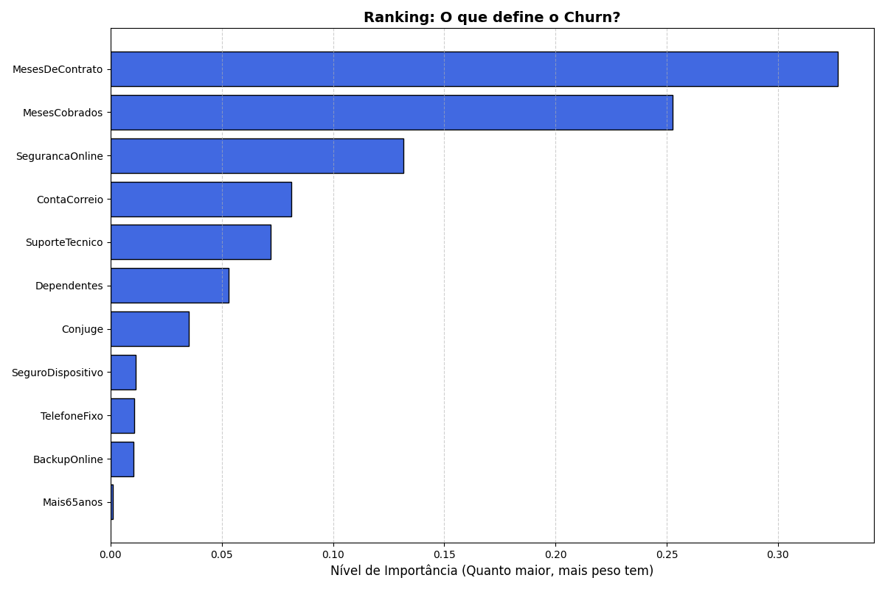

# 🚀 Predição de Churn com Machine Learning (PySpark)

## 📝 O que é este projeto?

## 📊 Gráfico de Importância das Features

Projeto desenvolvido para a Alura Voz, com o objetivo de reduzir a perda de clientes (Churn).
Foram aplicadas técnicas de Engenharia de Dados e Machine Learning com PySpark para identificar clientes com maior probabilidade de cancelamento dos serviços.

[Gráfico de Importância](importancia_features_v2.png)

🛠️ Etapas do Projeto — A Jornada do Dado
🔹 Limpeza e Tradução dos Dados

Transformação de dados categóricos em valores numéricos usando Dummies
(o Spark trabalha melhor com números do que com texto)

🔹 Vetorização

Consolidação de 24 características do cliente (features) em um Vetor Esparso, otimizando memória e processamento em larga escala

🔹 Batalha de Modelos

Testei três algoritmos para identificar o melhor desempenho preditivo:

Regressão Logística → o velocista

Árvore de Decisão → o visual

Random Forest → o comitê de especialistas

📊 Resultados e Performance

✅ Modelo escolhido: Random Forest

🎯 Acurácia final: 77,12%

⚖️ Dataset balanceado: 50% Churn / 50% Não Churn
(aprendizado justo, sem viés)

🕵️ Insights de Negócio (o que descobrimos?)

A análise de Feature Importance revelou os principais fatores de cancelamento:

Meses de Contrato (32%) → clientes novos precisam de mais atenção

Valor Cobrado (25%) → preço é decisivo para retenção

Segurança Online (13%) → serviços adicionais aumentam fidelização

💻 Tecnologias Utilizadas

Python & PySpark — processamento em larga escala

Spark MLlib — algoritmos de Machine Learning

Matplotlib & Pandas — visualização e análise exploratória

Google Colab — ambiente de desenvolvimento
